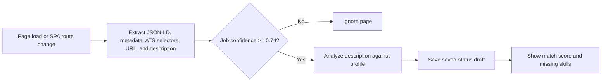

# Job detection, auto-draft tracking, and match score

## Product contract

ApplyPilot should save a draft only when the active page looks like a real job posting. It must not turn every page visited into a tracker item. Detection is automatic, but application submission remains manual.

## Implemented flow

### Detection signals

The extension checks, in priority order:

1. `JobPosting` JSON-LD structured data.
2. Job title, company, location, salary, employment type, and description fields from JSON-LD.
3. Open page metadata and common ATS selectors.
4. URL signals such as `/jobs`, `/careers`, `/positions`, `/apply`, Greenhouse job IDs, and Lever pages.
5. Job title vocabulary such as engineer, developer, designer, manager, analyst, scientist, architect, lead, and specialist.
6. Description vocabulary such as responsibilities, qualifications, requirements, benefits, and experience with.

A page must have meaningful job content. Short pages return `isJobPage: false` and are ignored.

### Auto-save behavior

- The content script detects initial pages, dynamic SPA route changes, and job content loaded by mutations.
- A detected page emits `JOB_PAGE_DETECTED`.
- The background worker checks authentication and the automatic tracking preference.
- The job is saved as a `saved` application draft.
- Duplicate URLs are normalized before insertion.
- Manual Save job also refuses pages that do not pass detection.
- Automatic tracking is enabled by default; the background setting is reserved for the popup control and future per-user preference UI.

## Match score

The match score is deterministic and description-first. It is not an unsupported LLM opinion.

Inputs:

- Job title
- Job description
- Extracted job skills
- Profile skills and skill years
- Technologies used in previous roles
- Project technologies
- Current and previous role titles
- Profile summaries and achievements

Weights:

- Detected skill coverage: 65%
- Role-title overlap: 20%
- Evidence/keyword overlap: 15%

When no explicit skills are detected, title and evidence overlap are used. When the description is shorter than 120 characters, the score is `0` and the UI explains that the description is too short for a reliable calculation.

The result stores:

- score from 0–100
- matched skills
- missing detected skills
- matched keywords
- description length
- calculation timestamp
- human-readable summary

The implementation is in [job-match.ts](../packages/shared/src/job-match.ts). The database columns are added by [202609090003_job_detection_and_match.sql](../supabase/migrations/202609090003_job_detection_and_match.sql).

## Tracker UI

The extension tracker shows a compact score badge. The web tracker shows:

- score badge on the job card;
- score, summary, matched skills, and missing skills in the detail drawer;
- the saved job description in a collapsible section.

This follows the useful part of Simplify's workflow: analyze the listing before application, surface match percentage and missing keywords, and save the listing into a tracker. ApplyPilot keeps the calculation explainable and profile-grounded instead of hiding the score behind an opaque model.

## Popup stability

The extension popup now uses a bounded 600px viewport with internal scrolling and contained overscroll. Long authentication/settings content stays inside the popup instead of expanding beyond the browser action window.

## Research

Research was checked against public descriptions of Simplify Copilot's workflow and common extension behavior. The repeated useful patterns were:

- build a profile once;
- activate on a recognized application or job page rather than every web page;
- analyze job descriptions and missing keywords;
- show a fit percentage on job cards;
- track roles and follow-ups after capture.

The implementation intentionally does not copy proprietary code or UI. It implements the general product pattern with local DOM/JSON-LD extraction, an explainable scorer, RLS-protected persistence, and user-controlled tracking.
