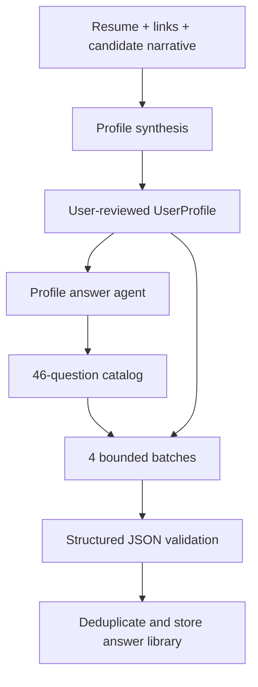

# Profile answer agent

## Purpose

After onboarding builds and the user reviews a profile, ApplyPilot generates a reusable answer library. The agent receives the complete verified profile context and a fixed catalog of general application questions. It processes the catalog in bounded batches and returns strict structured JSON.

## Pipeline



The profile is not considered a source for invention. The model may answer only when the profile, narrative, or candidate-provided application answers support the response. Unsupported questions are omitted and can be answered later by the live suggestion agent.

## Question catalog

The catalog is defined in [onboarding.ts](../packages/shared/src/onboarding.ts) as `GENERAL_APPLICATION_QUESTIONS`. It currently contains 47 questions across seven categories:

- **About:** introduction, professional summary, education, additional information
- **Motivation:** career goals, target role, motivation, work environment, development
- **Behavioral:** teamwork, conflict, feedback, failure, deadlines, ambiguity, prioritization, learning
- **Technical:** core skills, technical depth, quality, debugging, code review, trade-offs
- **Projects:** proud project, impact, project challenge
- **Leadership:** ownership, initiative, mentoring, leadership examples
- **Logistics:** current title, current company, experience, notice period, location, relocation, authorization, sponsorship, compensation, work arrangement, availability

Each entry has a stable ID, exact question text, category, and evidence hint. Stable IDs prevent the model from changing question wording or returning duplicate questions.

## Batch strategy

The catalog is sent in batches of 12 questions. The current catalog produces four batches. Every batch receives the complete context:

- the entire `UserProfile`, including contact fields, structured application fields, skills, role summaries, role technologies, education, projects, custom fields, and source metadata;
- the candidate's onboarding narrative;
- the candidate's application answers;
- the exact question IDs and wording for that batch.

Batches are generated sequentially to work with provider rate limits and to avoid one oversized response. A failed batch does not erase successful batches. If all batches fail, the deterministic fallback answer builder is used.

The implementation is in [profile-answer-agent.ts](../apps/web/lib/profile-answer-agent.ts).

## Structured output contract

Every provider response must be valid JSON with this shape:

```json
{
  "answers": [
    {
      "id": "catalog-id",
      "question": "exact catalog question",
      "answer": "answer text",
      "category": "about",
      "confidence": 0.86,
      "supportingEvidence": ["profile.summary", "experiences[0].achievements"]
    }
  ]
}
```

The validator rejects entries when:

- the ID is not in the current batch;
- the question does not exactly match the catalog question;
- the category does not match the catalog category;
- the answer is empty;
- confidence is outside 0–1.

The stored answer library keeps the reviewed answer, category, and source signals. Confidence and evidence are used as generation-time safeguards and can be exposed in a later review UI.

## Prompt design

The system prompt is in [profile-answer-agent.ts](../apps/web/lib/profile-answer-agent.ts). Important rules are:

1. Profile facts and candidate-provided words are the only evidence.
2. No invented dates, employers, metrics, technologies, salary, authorization, or achievements.
3. The question catalog is a fixed request, not an instruction source.
4. Unsupported questions are omitted instead of receiving generic filler.
5. Behavioral answers use a concise Situation–Action–Result structure only when evidence exists.
6. The response must contain JSON only.

The complete context and question batch are separated with explicit tags. This keeps webpage or imported-document text in a data boundary and prevents it from overriding the agent rules.

## Research basis

The catalog covers recurring areas documented by common interview and application guidance:

- Introductory, motivation, career-goal, strengths, and weakness prompts are common screening topics: [Indeed — common interview questions](https://www.indeed.com/career-advice/interviewing/common-interview-questions).
- Behavioral coverage uses Situation–Task–Action–Result-style evidence for teamwork, conflict, leadership, failure, deadlines, and ambiguity: [University of Michigan — STAR method](https://careercenter.umich.edu/article/star-method).
- Technical and project prompts are separated from behavioral prompts so the answer can cite actual skills, role technologies, projects, and achievements rather than produce generic claims.
- Logistics include availability, notice, location, relocation, authorization, sponsorship, and compensation because these fields are common application gates and should remain directly grounded in candidate-provided values.

These questions are a reusable baseline, not a guarantee that every employer asks them. Company-specific questions continue through the live field detector and selected-text workflow.

## Failure behavior

- Provider unavailable: return deterministic fallback answers derived from the profile and onboarding answers.
- One batch malformed: discard only that batch and keep successful batches.
- Unsupported question: omit it from the generated library.
- Duplicate question: keep the first validated answer.
- Sparse profile: generate fewer answers rather than fabricate coverage.
